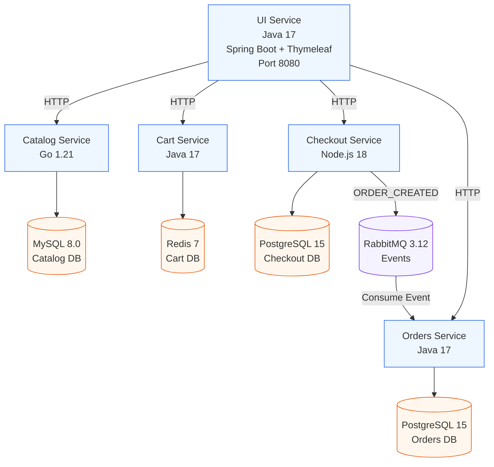

# 🎸 GuitarShop — Polyglot Microservices E-Commerce

A polyglot microservices e-commerce application for guitars, amps, and accessories.

Built with **Go, Java, Node.js, MySQL, Redis, PostgreSQL, RabbitMQ, and Docker Compose**.

Runs fully locally with Docker.

---

## 🏗 Architecture



---

## 🚀 How It Works

- The **UI Service** communicates with backend services using HTTP.
- Each service owns its own database (Database per Service pattern).
- When a customer checks out:
  - Checkout publishes an `ORDER_CREATED` event to RabbitMQ.
  - Orders consumes the event asynchronously.
  - The user gets an instant response while order processing happens in the background.

This demonstrates:
- Polyglot microservices
- Event-driven architecture
- Asynchronous processing
- Clean service isolation

---

## 🧰 Tech Stack

| Layer | Technology |
|-------|------------|
| UI | Java 17 + Spring Boot + Thymeleaf |
| Catalog | Go 1.21 |
| Cart | Java 17 + Spring Boot |
| Checkout | Node.js 18 + Express |
| Orders | Java 17 + Spring Boot |
| Catalog DB | MySQL 8 |
| Cart DB | Redis 7 |
| Checkout DB | PostgreSQL 15 |
| Orders DB | PostgreSQL 15 |
| Messaging | RabbitMQ 3.12 |
| Orchestration | Docker + Docker Compose |

---

## 🐳 Run Locally

Clone the repository:

```bash
git clone https://github.com/Hepher114/guitar-shop-microservices.git
cd guitar-shop-microservices
```

Start the system:

```bash
docker compose up --build
```

Access:

- Storefront → http://localhost:8080  
- RabbitMQ UI → http://localhost:15672  
  - Username: guitarshop  
  - Password: guitarshop123  

Stop and remove all containers + volumes:

```bash
docker compose down -v
```

---

## 📂 Project Structure

```
guitar-shop-microservices/
├── docker-compose.yml
├── README.md
└── services/
    ├── catalog/     (Go)
    ├── cart/        (Java)
    ├── checkout/    (Node.js)
    ├── orders/      (Java)
    └── ui/          (Java + Thymeleaf)
```


