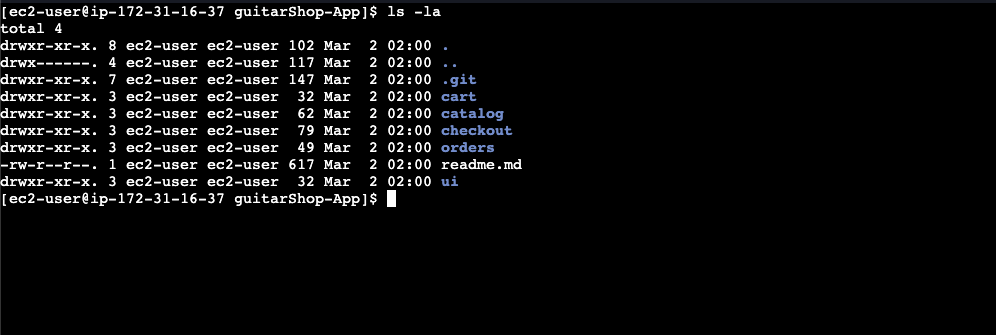

# Clone the Application Repository

## I. Prerequisites

- ✅ EC2 instance running
- ✅ Docker installed
- ✅ App code pushed to GitHub by the dev team

---

## II. Install Git

```bash
sudo dnf install git -y
git --version
```

---

## III. Clone the Repository

```bash
git clone https://github.com/Hepher114/guitarShop-App.git
cd guitarshop-app
```

---

## IV. Verify the Project Structure

```bash
ls -la
```

You should see:

```
guitarshop-app/
├── cart/
├── catalog/
├── checkout/
├── orders/
├── ui/
└── readme.md
```